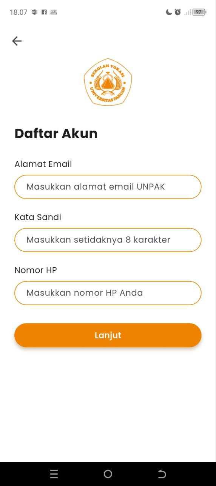

# 🎓 Vokasi UNPAK Mobile App

Aplikasi mobile untuk mahasiswa Vokasi Universitas Pakuan (UNPAK) dengan sistem autentikasi dan manajemen profil berbasis Flutter.

## 🌟 Fitur Utama
✅ **Autentikasi Pengguna**  
- Login dengan email UNPAK (@unpak.ac.id)
- Registrasi akun baru
- Reset password 

✅ **Manajemen Profil**  
- Edit data pribadi mahasiswa
- Toggle dark/light mode

✅ **Teknologi Modern**  
- State management dengan Provider
- Tema dinamis (light/dark mode)
- Navigasi antar halaman

## 📸 Screenshot Aplikasi

### Halaman Awal
| Light Mode | Dark Mode |
|------------|-----------|
|  |  |

### Halaman Login & Register
| Login Screen | Register Screen |
|----------------|-----------------|
|  |  |

### Halaman Password Recovery & Detail Account
| Password Recovery Screen | Detail Account Screen |
|----------------|-----------------|
|  |  |

### Halaman Profil
| Light Mode | Dark Mode |
|------------|-----------|
|  |  |

## 📸 Screenshot Implementasi Code
### Code Manajemen Tema
  

### Code Login
  
